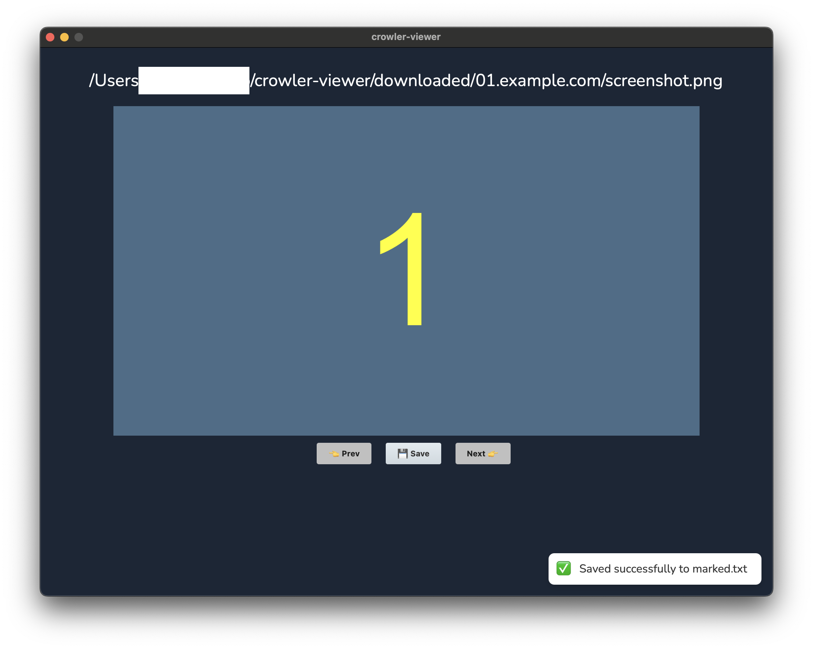

# crowler-viewer

*Viewer for [crowler](https://github.com/xryuseix/crowler)*



```txt
# .env
OUT_DIR=/foo/bar/path/crowler/app/out
SAVE_FILE=/foo/bar/path/marked.txt
TRASH_DIR=/Users/foo/.Trash
```
